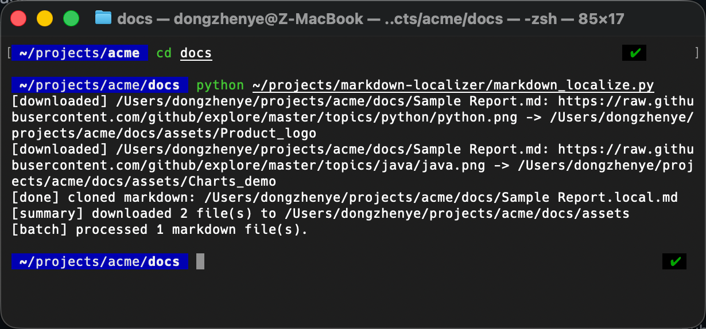

# Markdown Localizer

[](LICENSE)
[](#installation)

Turn Markdown with remote images into portable, self-contained documents.

Create local, self-contained copies of Markdown documents by downloading remote image links into an `assets/` folder and rewriting the Markdown to reference the local files. The source document stays untouched, which makes it ideal for Confluence exports or any Markdown using `` syntax.



## Features
- Converts single files or entire directory trees
- Skips already-localized `*.local.md` files to avoid duplicates
- Deduplicates downloads and auto-renames conflicting filenames
- Pure Python (stdlib only) with no external dependencies

## Installation
- Requires Python 3.9+
- Clone or download this repository and run the script directly; no packaging or build steps are needed

## Usage
### Single Markdown file
```bash
cd /path/to/your/docs
python ~/projects/markdown-localizer/markdown_localize.py "Sample document.md"
```
The script downloads all matching images to `assets/` and writes `Sample document.local.md`, preserving the original file.

### Current directory batch (no args)
```bash
cd /path/to/your/docs
python ~/projects/markdown-localizer/markdown_localize.py
```
Every Markdown file under the current directory tree is processed, except files already ending in `.local.md`.

### Explicit directory or deep tree
```bash
python ~/projects/markdown-localizer/markdown_localize.py /path/to/tree
```
Point the script at any directory to recursively process it. Use the advanced options below when you need custom naming or tighter URL filters.

## Command-line options
| Option | Description | Default |
| --- | --- | --- |
| `--suffix <text>` | Inserted before the Markdown extension of the cloned file. | `.local` |
| `--assets-dir <dir>` | Directory (relative to the Markdown file) used to store downloaded assets. | `assets` |
| `--pattern <regex>` | Regex applied to image URLs to decide which ones to download. Useful for host allow-lists. | `https?://` |

### Advanced example
```bash
python ~/projects/markdown-localizer/markdown_localize.py \
  /path/to/tree \
  --suffix .localized \
  --assets-dir assets_custom \
  --pattern 'media-cdn\\.atlassian\\.com'
```
This run customizes the output naming and restricts downloads to Atlassian’s CDN.

## Tips & shortcuts
Add a helper to your shell configuration so you can call the tool from anywhere without typing long paths:
```bash
# Alias when you always pass an explicit path
alias mdloc='python ~/projects/markdown-localizer/markdown_localize.py'

# Function keeps tab completion and defaults to the current directory
mdloc() {
  python ~/projects/markdown-localizer/markdown_localize.py "${1:-.}"
}
```
Reload your shell (for example `source ~/.zshrc`) and call `mdloc` from anywhere. The function mirrors the script’s default behavior of treating “no argument” as “current directory”.

## FAQ
### Does the script modify the original Markdown?
No. It always writes a new file using the configured suffix (default `.local.md`) and rewrites image links only in the cloned copy.

### What happens to existing assets or duplicate URLs?
Existing files inside the assets directory are left untouched. Each download first checks for matching URLs, prefers the Markdown alt text (falling back to a sanitized URL basename), and allocates unique names by appending `_1`, `_2`, and so on if needed.

### Can I rerun it safely on the same folder?
Yes. The tool skips files ending in `.local.md` and reuses the assets directory, so rerunning simply processes any newly added Markdown files or links that were not previously localized.

### Why do some downloads fail after a while?
Confluence and similar platforms sometimes embed short-lived tokens in image URLs. Run the localizer soon after exporting (ideally within 24 hours) to avoid expired links. Failed downloads are logged but do not stop the rest of the batch.
